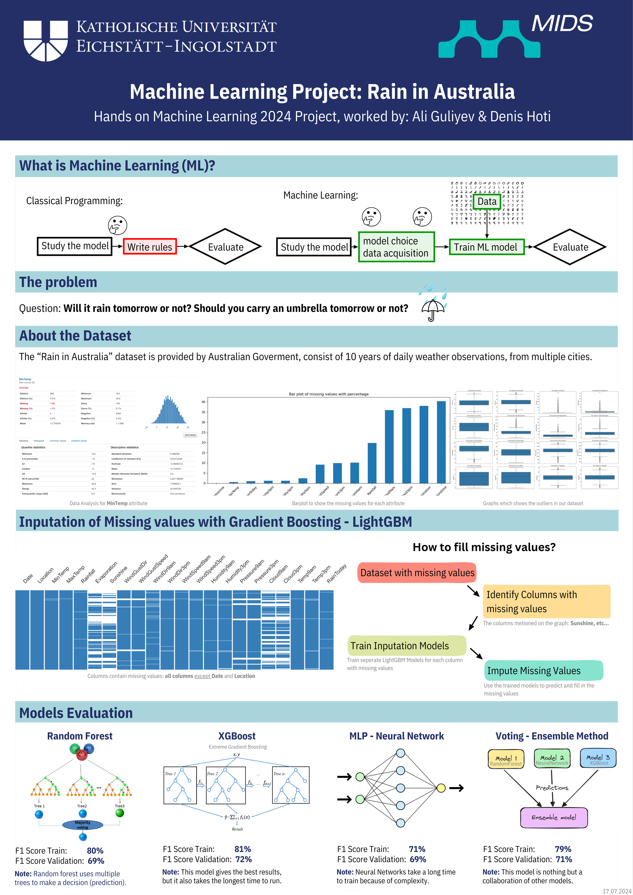

# Rain in Australia - Hands on Machine Learning Class Project

In my second semester, in the Data Science course at the [Catholic University of Eichstaett-Ingolstadt](https://www.ku.de/studienangebot/data-science), we had the class "Hands-on Machine Learning and Data Science", me and my university colleague, Ali Guliyev were assigned to work on this Machine Learning project as our Final Project.

The project we had to work on is [Rain in Australia](https://www.kaggle.com/datasets/jsphyg/weather-dataset-rattle-package), the main goal on our project was for us to practice on a real project, to use what we learned during the lectures in the project, and to have a better understanding of Machine Learning with Python.

The **Rain in Australia** dataset can be used to to predict if tomorrow will Rain or no. This Dataset contains of 10 years of Weather Data collected in Australia between 1st of November 2007 up to 25th of June 2017. This dataset contains of 145,000 instances and it has 23 features.
The dataset is a very good one, even that because it has a lot of missing values, it is highly unbalanced, it is a time series data, it can be a bit not beginner friendly, as this was our first ML Project. But we found it very interesting, and a great way to learn more and practice better.

## Project Requirements

We were advised to write the whole project on a Jupyter Notebook, also we had to include documentation together with the code. 

These are some of the objectives we had to take in consideration while working on the project:
- Get the data
- Frame the problem and look at the big picture (formulate reasonable question(s) we want to solve)
- Explore the data to get insights
- Prepare the data to better expose the underlying data patterns to Ml algorithms
- Explore many different models and shortlist the best ones.
- Fine-tune your models and select the best one. If needed, combine multiple models. 
- Present your solution.

The project had to be submitted in Milestones, so thats why you will find in this repository each of Milestones, the final submission is the file "main.ipynb.

## Our Achievement

We have successfully completed the project and meet all the deadlines for the project submission. Except these we are very happy that we could create a well written code and documented. We were able to use and understand a lot of aspects of Machine Learning, even include in our project very advanced Machine Learning techniques.

We have been able to understand the dataset we had to work with, to analyze the dataset. After this to continue with Data Cleaning aspects, which is very important. We also took care of the outliers in our dataset.

After understanding the dataset, we have continued with exploring different models, that we can inclide in out dataset to get a better results.

We have tested many different models, but at the end we only included 5 (KNN Classification, Logistic Regression, RandomForest, XGBoost, Neural Network Model) in our notebook. Then after checking the results, the ones that had the best evaluation were RandomForest, XGBoost, and Neural Network.

Also, we included Voting Classifier - Ensemble Method, which would take these last three models, and evaluate and get the best result out of them.

## Project Presentation
As part of our work, we also had at the end of semester present our project in front of the professors and university colleagues. The presentation we worked and presented, can be found in this Repository.

## Contributors

- [**Denis Hoti**](https://denishoti.dev)
- [**Ali Guliyev**](#)

We would like to specially thank our Hand-On Machine Learning professors, for supervising us:
- **Prof. Felix Voigtlaender**
- **Paul Geuchen**